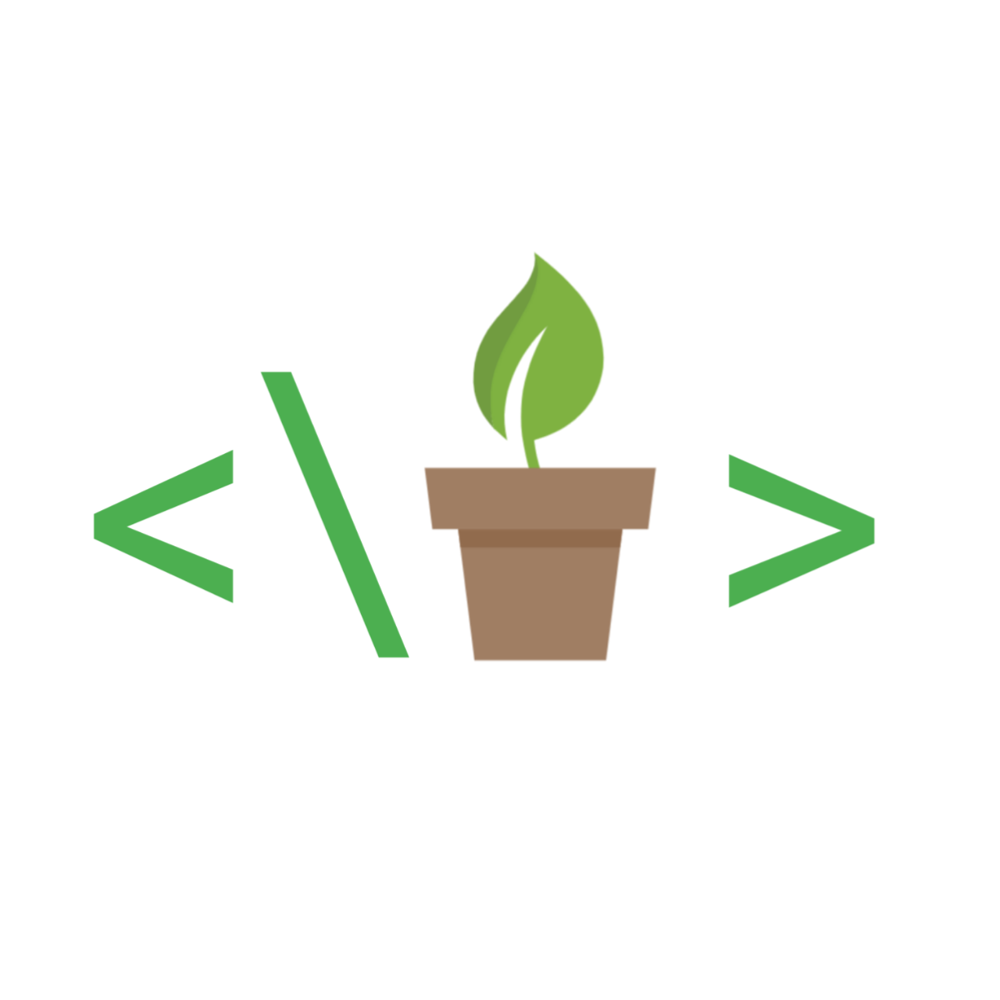

# Green Coder

 

## About
A code editor which is made in Sketchware. This is a big project which is unfinished! I will try to finish it soon!

 
**Note: it is in it's alpha stages!**

## Screenshots

<b>
Settings Activity
</b>

<b>
Home Activity (without projects)
</b>

<b>
Home Activity
</b>

## TODO List
I have more goals but unable to do it because of my abilities but i never give up!

- [ ] Autocompletion codes
- [ ] indication of errors in codes
- [ ] Advanced projects manager

## Resources
As i said in description, I'm making green coder in pure **vannila sketchware v3.10.0**. My only goal is to make advanced Code editor with orginal sketchware!

## Installation
It is recommended to use [latest version](https://github.com/GreenCityLife/Green-Coder/releases). You should only report bugs for latest version.

There is [Coder.apk](bin/coder.apk?raw=true) in bin folder if you want to get latest features before release which is updated after every commit. Download it on your own risk and help finding out bugs to repair them!

## Contributing
Contributions are what make the open source community such an amazing place to learn, inspire, and create. Any contributions you make are **greatly appreciated**.

If you have a suggestion that would make this better, please fork the repo and create a pull request. You can also simply open an issue with the tag "enhancement". Don't forget to give the project a star! Thanks again!

1. Fork the Project
2. Create your Feature Branch (git checkout -b feature/AmazingFeature)
3. Commit your Changes (git commit -m 'Add some AmazingFeature')
4. Push to the Branch (git push origin feature/AmazingFeature)
5. Open a Pull Request

## License
Licensed under [GNU General Public License v3.0](https://www.gnu.org/licenses/gpl-3.0.en.html). Check [LICENSE](LICENSE) for more details
